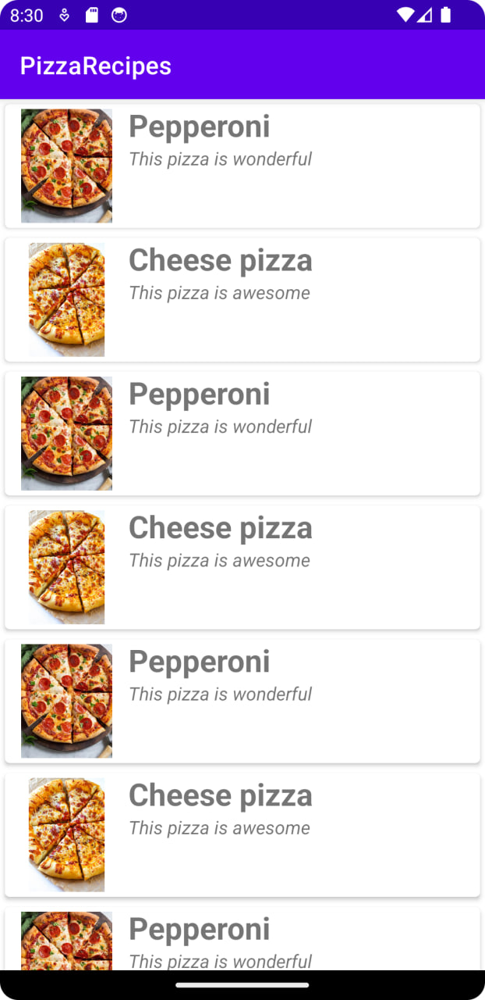
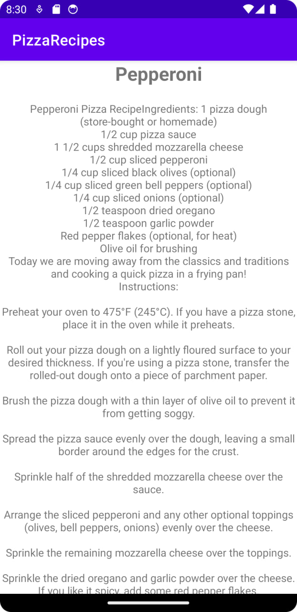

# Pizza Recipes

## Studied: 

- Study the layouts and user interface design of the application.
- Use of various widgets such as buttons, text fields, images and lists.
- Create custom layouts and elements.
- Store and manage pizza recipe data such as name, ingredients, instructions and photos.
- Create navigation menus and screens to view a list of recipes and the details of each recipe.
- Learning the concept of activities and fragments to control different parts of the application.
- Upload and display recipe images.
- Working with events such as button clicks and gestures.
- Implementing user interaction with the application, for example, adding recipes to favorites or commenting on recipes.
- Working with Android APIs and libraries.

## Demo:

